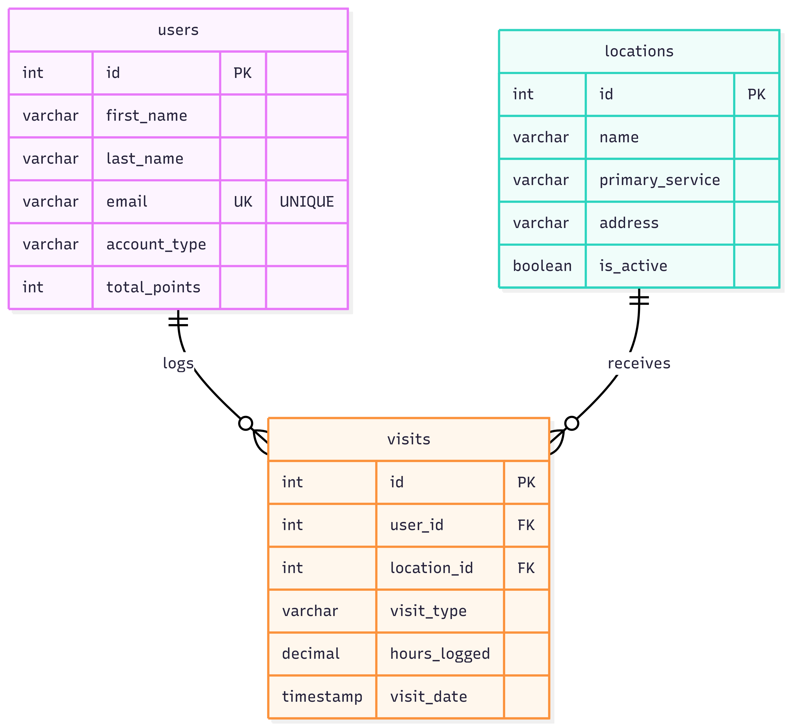

# Branch | Community Connection App

Live App: https://branch-app.streamlit.app/
### Project Description

Branch is a community connection platform that bridges the gap between volunteers and people in need of resources. Volunteers use the app to find opportunities and log hours, while Community Members use it to locate essential services.
### Database Schema

- users: Tracks both Volunteers and Community Members, storing contact info and gamification points.

- locations: Stores active community resources (Food Pantries, Shelters, etc.) and their addresses.

- visits: The junction table that links users and locations, tracking when a user volunteers or receives resources.

### Entity-Relationship Diagram

(Insert your ERD image here. e.g., )
How to Run Locally

    Clone this repository.

    Install dependencies: pip install -r requirements.txt

    Create a .streamlit/secrets.toml file and add the DB_URL connection string.

    Run the app: streamlit run streamlit_app.py
